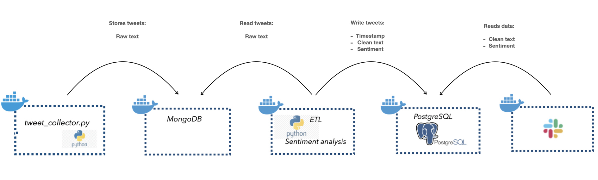

# A Dockerized Data Pipeline for Sentiment Analysis on tweets
There are 5 steps in the **data pipeline**:
- Extract tweets with [Tweepy API](https://docs.tweepy.org/en/stable/index.html) 
- Loaded the tweets in a **MongoDB**
- Extracted the tweets from **MongoDB**, performed **sentiment analysis** on the tweets, and loaded the transformed data in a **PostgresDB** **(ETL job)**
- Loaded the tweets and corresponding sentiment assessment in a **PostgresDB**
- Extracted the data from the **PostgresDB** and posted it in a slack channel with a **Slack bot**



## Usage
- Install [Docker](https://docs.docker.com/get-docker/) on your machine
- Clone the repository: ``` git clone https://github.com/miladbehrooz/Dockerized_Data_Pipeline.git```
- Get credentials for Twitter API and insert them in ```tweet_collector/credentials.py```
- Get credentials for [Slack bot](https://api.slack.com/apps) and insert them in ```slack_bot/credentials.py```
- Run ```docker-compose build```, then ```docker-compose up``` in terminal
